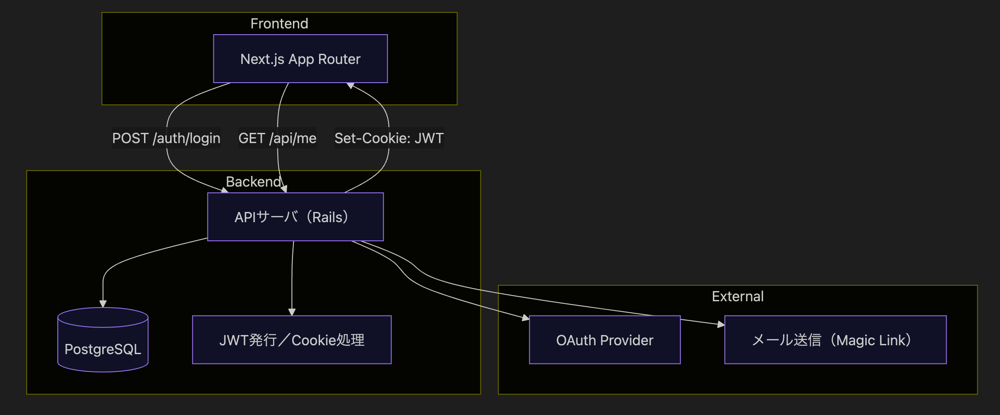

# 認証・許可アーキテクチャ設計ポートフォリオ

本リポジトリは、**認証・認可を中心とした疎結合Webアーキテクチャの構想・設計ドキュメント**です。
実装済みコードや動作デモは別リポジトリ（例：`auth-portfolio/`）にて管理しています。

---

## 目的

- 認証方式（OAuth2 / 自前パスワード / Magic Link / APIキーなど）を一元的に理解・設計する
- Next.js (App Router) + Rails API サーバによる分離構成を通して、**クラサバ構成全体を体系的に再現**
- 再利用可能・拡張可能なアーキテクチャ設計力をポートフォリオとして提示

---

## 採用アーキテクチャ構成

- **バックエンド**：Rails APIサーバ

  - 認証処理（JWT発行、Cookie管理）
  - メール送信（Magic Link、パスリセット等）
  - PostgreSQL

- **フロントエンド**：Next.js (App Router構成)

  - CSR / SSR混在構成
  - `useAuth()`や`middleware.ts`で認証UI切り替え／保護

- サーバとクライアントは別ドメイン

- **通信**：CookieベースまたはBearerトークン（CORS越境対応）

---

## 対応認証方式

| 認証方式                     | ステータス  | 備考                       |
| ---------------------------- | ----------- | -------------------------- |
| 自前パスワードログイン       | 🔧 実装中   | JWT + Cookie構成           |
| OAuth2（PKCE）               | 📝 計画     | Google等との連携           |
| Magic Link                   | 📝 計画     | メールによるリンクログイン |
| SNSログイン（LINE/GitHub等） | 📝 計画     | OAuth2の応用構成           |
| 外部IdP（SAML/OIDC）         | ✍ 設計のみ | 実装せず図解で対応         |
| APIキー／Basic認証           | ✍ 設計のみ | CLI・外部連携向け          |

---

## 本構成（APIサーバ + 別ドメインNext.js CSR/SSR混在）における、認証方式ごとのセキュリティ対策・構成比較一覧

クライアント・サーバ構成の一覧は次の節にあります。`SSR`などの略称もそちらを参照ください。

ここでは、本構成（APIサーバ + 別ドメインNext.js CSR/SSR混在）を取ることで、認証方式に関しては他のクライアント・サーバ構成を全て網羅するを示します。

| 認証方式               | 対策対象                                                               | 本構成での実装                                                                                                                                                                  | 他のクライアント・サーバ構成との違い                                                                                                 | 備考                                                                                                            |
| ---------------------- | ---------------------------------------------------------------------- | ------------------------------------------------------------------------------------------------------------------------------------------------------------------------------- | ------------------------------------------------------------------------------------------------------------------------------------ | --------------------------------------------------------------------------------------------------------------- |
| 自前パスワードログイン | セッション固定 / CSRF ＋CSR/SSRのCookie／状態不一致対策             | パスワードログイン成功時にJWTを生成し、`HttpOnly`, `Secure`, `SameSite=None`付きのCookieに保存。 SSRではレスポンスで`Set-Cookie`を返し、CSRでは`/api/me`で状態を明示的に同期 | ◯ MPA/SSRでは`SameSite=Lax`やセッションCookieで自然に対策できるケースが多い ◯ CSR/SPAではCSRFトークン等を明示的に管理する必要あり | 本構成では**SSR/CSR間で認証状態を正しく共有・同期するための実装が必要。クッキー属性の扱いも厳密さが求められる** |
| OAuth2（PKCE）         | code injection / redirect forgery ＋CSR/SSRのCookie／状態不一致対策 | PKCEを用いたトークン取得 + JWTをCookieに保存。 SSR用に`Set-Cookie`で状態付与 + CSR用に`/api/me`で状態取得を同期                                                              | ◯ CSR/SPA：PKCE必須、状態管理は完全にクライアント側 ◯ SSR/BFF：サーバが状態管理できるがPKCEは省略可                               | 本構成では**CSRとSSR間で状態を整合させる必要あり。実務と同じ課題に向き合える**                                  |
| Magic Link             | リンク再利用 / トークン盗用 ＋URL露出／状態遷移ギャップ             | メールでワンタイムトークン付きリンクを送信。リンククリック時に有効性チェック → JWT発行・Cookie保存。 CSR側ではクエリからの状態遷移とCookie処理を`/api/me`で同期              | ◯ SSRではリダイレクト後にCookieを即時適用できるが、SPAではJS遷移・URL露出のリスクあり                                                | 本構成では**Magic Linkトークンの有効性判定と状態遷移処理をCSR/SSRで分岐しつつ統合する必要がある**               |
| SNSログイン（OAuth2）  | 上記OAuth2に同じ                                                       | OAuth2 + PKCE + scope制限 + nonce対応。JWT化してCookie保存                                                                                                                      | ◯ モバイル/SPAではPKCE必須 ◯ MPA/SSR/BFFではOAuth2フローをバックエンドのみで完結させられる構成もあり                              | 本構成では**CSR/SSR混在ゆえ、OAuth2リダイレクト後の状態同期・`state`の整合が必要**                              |
| 外部IdP（SAML/OIDC）   | Assertion改ざん / RelayState固定                                       | SP（サービスプロバイダ）設定に基づくSAML assertionの署名検証。POST/Redirect Binding対応（※本構成では設計想定のみ）                                                              | ◯ MPA/SSR構成ではサーバ完結で処理しやすい ✗ SPA/CSR構成ではPOSTリレーやCookie状態管理が難しくなる                                 | 本構成では**フロントエンドとの連携が煩雑になるため、IdP連携の設計・理解を明示できること自体が強み**             |
| APIキー／Basic認証     | 認証情報の漏洩 / 不正利用                                              | HTTPS通信 + Bearer／Basicヘッダーでの認証。クライアントにはキーを環境変数やCLI経由で注入。認可範囲や使用ログ設計も併用                                                          | ◯ CLIや外部連携向けでは扱いやすい構成。SPAではキーの安全な保存・取り扱いが難しくセキュリティ懸念がある                               | 本構成では**CORS対応・HTTPS強制を踏まえつつ、ヘッダー認証の取り扱いにおいてセキュリティ設計力を示せる構成**     |

### クライアント・サーバ構成 一覧

取りうる全てのクライアント・サーバ構成です。

| #   | 構成名                                 | 略称     | 説明                                                                                                                                                         | 実装例                                  | 備考                                                                                         |
| --- | -------------------------------------- | -------- | ------------------------------------------------------------------------------------------------------------------------------------------------------------ | --------------------------------------- | -------------------------------------------------------------------------------------------- |
| 1   | CSRとSSR混在 APIサーバと別ドメイン構成 | 本構成   | フロントエンド（Next.js App Router）がCSRとSSRを併用。 Rails APIサーバとは別ドメインで通信し、CookieやCORS、認証状態の同期が必要。                        | Next.js (App Router) + Rails API        | **状態の整合性やクッキー設定が実務と同じレベルで求められる。セキュリティ要件も高い。**       |
| 2   | CSR + BFF                              | CSR      | フロントはCSR（Single Page Application）。 データ取得は`/api`などのBFF層を介して同ドメイン内で行うため、CORS対応不要。                                    | Nuxt.js / Next.js (Pages Router)        | クライアントとAPIが同じオリジン。PKCE不要。セッション管理も容易。                            |
| 3   | SSR + BFF（App RouterでのSSR）         | SSR      | SSR中に`generateMetadata()`等でAPIリクエストをサーバ側から送信。状態管理は主にサーバ側で完結。                                                               | Next.js App Router (`generateMetadata`) | BFFと同じく**CORSやPKCE不要**。ただし、SSO連携時などは **`state`や`nonce`管理が必要** 。     |
| 4   | テンプレートレンダリング（MPA）        | MPA      | サーバ（Railsなど）がHTMLを生成・返却する多ページアプリ（Multi Page App）。ログイン状態はセッションやCookieで保持。                                          | Rails（ERB）, Laravel（Blade）など      | 旧来の構成。サーバ側で状態管理できるため、**CSRFやセッション固定などは自然に処理しやすい。** |
| 5   | SPA完全分離構成                        | SPA      | クライアントが完全に状態管理を担う構成。APIとはCORS経由で通信。クッキー管理やトークン保存、リフレッシュ処理なども自前で実装。                                | Vite + Rails API など                   | **セキュリティ設計や状態保持の設計が最も難しい。PKCEがほぼ必須。**                           |
| 6   | モバイル + API                         | モバイル | ExpoやReact Native、FlutterなどのアプリがAPIにアクセス。セッションCookieは使えず、常にトークン（Bearer）が必要。                                             | Expo + Rails API                        | クライアントに秘匿情報を持たせられないため、**PKCEや認証制限設計が重要。**                   |
| 7   | CLI + API                              | CLI      | CLIやサーバスクリプトなどからAPIを直接叩く構成。APIキーやBasic認証などを用いるケースが多い。                                                                 | Node.js CLI + fetch                     | **APIキーの管理・権限設計・使用ログの記録などが重要。セキュリティ制御が個別に必要。**        |
| 8   | モノリシックWebアプリケーション        | なし     | WordPressやRailsのデフォルト構成が代表例で、管理画面やフォーム送信後のリダイレクト処理など、1つのHTMLレスポンスで全てを処理する従来型のWebアプリケーション。 | Rails単体構成, WordPressなど            | MPAに近い。状態管理が自然にサーバ側で完結するが、スケールしにくいこともある。                |

---

## 🗺 システム構成図（Mermaid）

---

## 📜 各機能構成の進行状況

本リポジトリは構成全体を示すものであり、実装は**機能ごとに個別リポジトリで段階的に進行中**です。

### 🔧 現在実装中（Rails + Next.js分離構成）

- [ ] 自前パスワードログイン（JWT + Cookie）

  - `/auth/register`, `/auth/login`, `/auth/logout`
  - Cookie属性：Secure, HttpOnly, SameSite=None
  - `/api/me`による認証状態取得

### 📜 今後予定（Rails + Next.js構成での追加機能）

それぞれ別リポジトリに作成する予定です。

- [ ] OAuth2（PKCEフロー）ログイン
- [ ] Magic Link ログイン（メール送信）
- [ ] SNSログイン（GitHub, LINE など）
- [ ] パスワードリセット／メール認証（Tokenリンク方式）
- [ ] APIキー or Basic認証によるCLIアクセス
- [ ] RBAC（ロール管理）／通知一覧／ファイルアップロード／アクティビティログなどの保護機能

---

## 最後に

今後の開発案件／チーム開発／アーキテクト的立場での活動に向け、継続的にアップデートしていきます。
